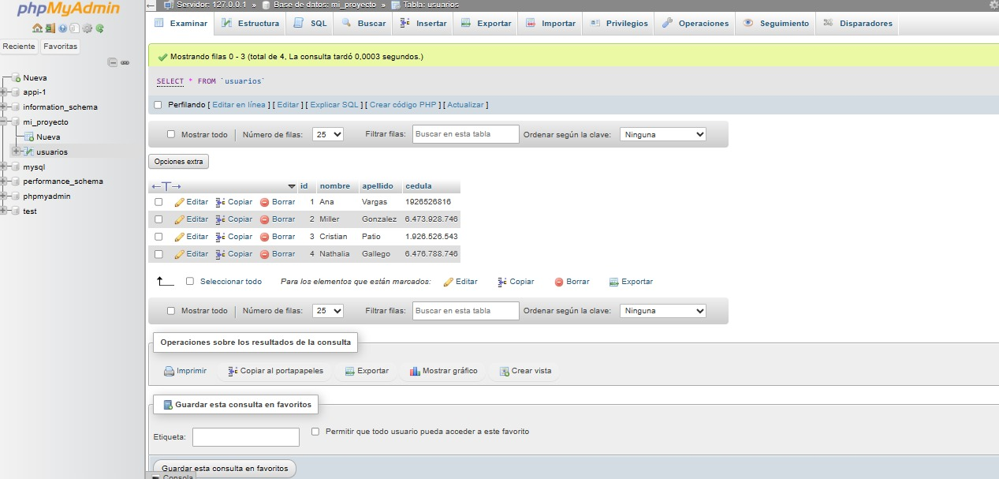

<h1>TALLER UNIDAD 10: Ana Maria Vargas</h1>

<h2>Información</h2>

curso full stack basico: grupo1

profesor: Cristian Patiño

<h2>punto 1:</h2>

<h2>punto 2:</h2>

<h2>Punto 3:</h2>

<h2>Punto 4:</h2>

<h2>Punto 5-6-7:</h2>
<h3>5-Base de Datos</h3>

